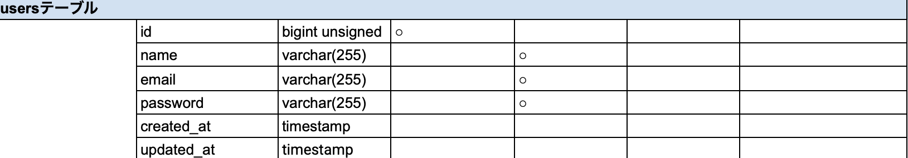
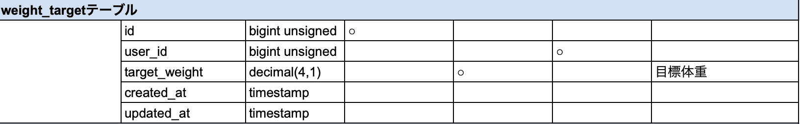
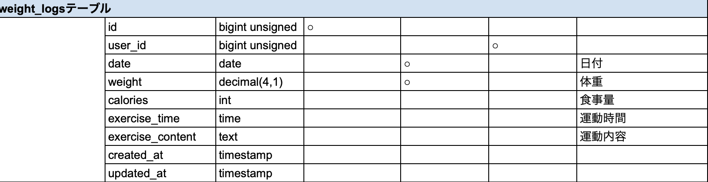

# Pigly
## 環境構築
### dockerビルド
1. `git clone https://github.com/ayadoon0720-cpu/weight-control-app-test.git`
2. `cd weight-control-app-test`
3. DockerDesktopアプリを立ち上げる
4. `docker-compose up -d --build`
### Laravel環境構築
1. `docker-compose exec php bash`
2. `composer install`
3. 「.env.example」ファイルを 「.env」ファイルに命名を変更。または、新しく.envファイルを作成
4. 「.env」ファイルに以下の環境変数を追加
```
DB_CONNECTION=mysql
DB_HOST=mysql
DB_PORT=3306
DB_DATABASE=laravel_db
DB_USERNAME=laravel_user
DB_PASSWORD=laravel_pass
```
6. アプリケーションキーの作成
```
php artisan key:generate
```
8. マイグレーションの実行
```
php artisan migrate
```
10. シーディングの実行
```
php artisan migrate:fresh --seed
```
## 使用技術(実行環境)
- PHP8.1.34
- Laravel8.83.8
- MySQL8.0.36
## テーブル設計



## ER図

## URL
- 開発環境：http://localhost/
- phpMyAdmin：http://localhost:8080/
